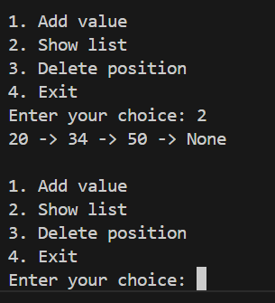

# PERFOMING BASIC OPERATIONS ON SINGLY LINKEDLIST
1.CREATE
2.ADDING ELEMENTS
3.VIEW
4.DELETING ELEMENT FROM Nth position

## In this code we used the object oriented python programming principles to implement singly linkedlist
Here is the output of the code
